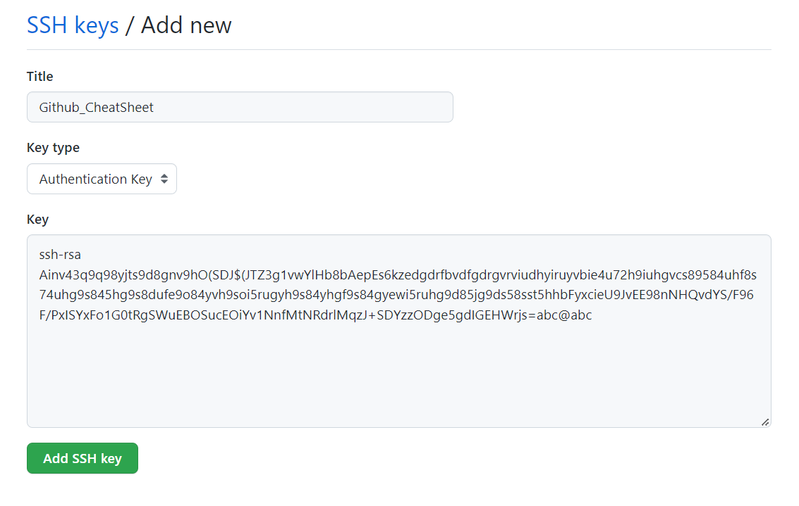

# Git & GitHub

---

# 1. Initialize a local repository

- *Bash Code*
    
    ```bash
    $ git init    # Initialize a git repository
    $ touch README.md    # Create a markdown file
    ```
    

# 2. Connect local and repo site — SSH key

### 2.1. Create a local .ssh directory

- *Bash Code*
    
    ```bash
    # The .ssh folder should not be created within the repo
    $ mkdir ../.ssh    # Create a .ssh folder for ssh-key storage
    $ touch .gitignore  # Create a .gitignore
    $ printf ".ssh" >> .gitignore  # Ignore .ssh directory
    
    # Here's the created .ssh folder directory, for example:
    # /d/github/P10911004-NPUST/Github_CheatSheet/.ssh (main)
    $ ..    # return to parent directory to avoid confusion
    
    # Generate ssh-key
    $ ssh-keygen
    Generating public/private rsa key pair.
    Enter file in which to save the key (/c/Users/.ssh/id_rsa): .ssh/id_rsa
    Enter passphrase (empty for no passphrase):    # Set no password
    Enter same passphrase again:                   # Set no password
    
    #Here’s the output console:
    Your identification has been saved in .ssh/id_rsa
    Your public key has been saved in .ssh/id_rsa.pub
    The key fingerprint is:
    SHA256:8ypc157oP3o9HOD8y7q7rfVhgT/9GAqm9Q1lDb1d3y4 joonk@JK
    The key's randomart image is:
    +---[RSA 3072]----+
    |                 |
    |               . |
    |              . o|
    |            . .o*|
    |        S  + ooo=|
    |        .o. +oo.o|
    |     . . .=o.=E*o|
    |      o  =.o=B*=+|
    |       .o.o+XB*oo|
    +----[SHA256]-----+
    ```
    

### 2.2. SSH **public** key — SSH and GPG keys at GitHub setting page

- *Bash Code*
    
    ```bash
    $ ls -al .ssh    # Have a look on the .ssh folder
    $ cat .ssh/id_rsa.pub    # Print out the public key
    
    # Copy the printed phrase below (for example) and paste it to the Github SSH setting
    ssh-rsa Ainv43q9q98yjts9d8gnv9hO(SDJ$(JTZ3g1vwYlHb8bAepEs6kzedgdrfbvdfgdrgvrviudhyiruyvbie4u72h9iuhgvcs89584uhf8s74uhg9s845hg9s8dufe9o84yvh9soi5rugyh9s84yhgf9s84gyewi5ruhg9d85jg9ds58sst5hhbFyxcieU9JvEE98nNHQvdYS/F96F/PxISYxFo1G0tRgSWuEBOSucEOiYv1NnfMtNRdrlMqzJ+SDYzzODge5gdIGEHWrjs=abc@abc
    ```
    



### 2.3. SSH **private** key — ssh-agent

- *Bash Code*
    
    ```bash
    $ eval $(ssh-agent)  # Turn on the key agent to record the private key, i.e. id_rsa
    Agent pid 1603  # This message shows that agent had been activated
    
    $ ssh-add .ssh/id_rsa    # Add the private key to the ssh-key agentt
    Identity added: .ssh/id_rsa (abc@abc)    # The key was successfully added
    
    $ ssh -T git@github.com    
    # The private key successsfully matched with the public key
    Hi P10911004-NPUST! You've successfully authenticated, but GitHub does not provide shell access.
    ```
    

# 3. Connect local repo to remote repo

- *Bash Code*
    
    ```bash
    $ git remote add origin git@github.com:P10911004-NPUST/Github_CheatSheet.git
    $ git remote    # Check the connecting remote repo name
    origin
    ```
    

# 4. Initial commit

- *Bash Code*
    
    ```bash
    $ git add .
    $ git commit -m "first commit"
    ```
    

# 5. Push to remote repo

- Bash Code
    
    ```bash
    $ git push origin main
    ```
    

# 9. Clone a private repo from GitHub

```bash
git clone -c "core.sshCommand=ssh -i ~/.ssh/id_rsa -F /dev/null" git@github.com:example/example.git
```
